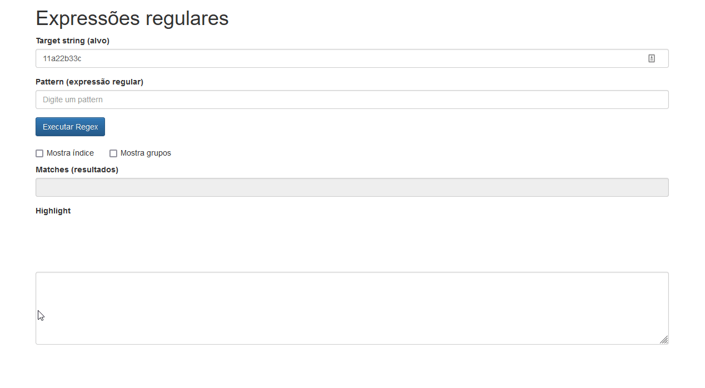

<h1 align="center">
     
    Tester for Regular Expressions and study of methods
</h1>

This project was developed in the course of <a href="https://www.alura.com.br/curso-online-expressoes-regulares">"Expressões Regulares - Capturando texto de forma mágica"</a> of Alura finished in January 03, 2022. 

  

  

## 🚀 Technologies
-  **HTML e CSS**

-  **JavaScript**

## License

This project is licensed under the MIT License - see the [LICENSE](https://opensource.org/licenses/MIT) page for details.

-------------------------------------

Made with ♥ by Merieli Manzano